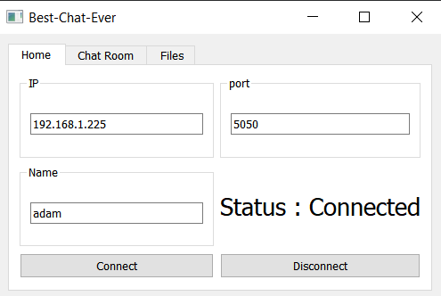
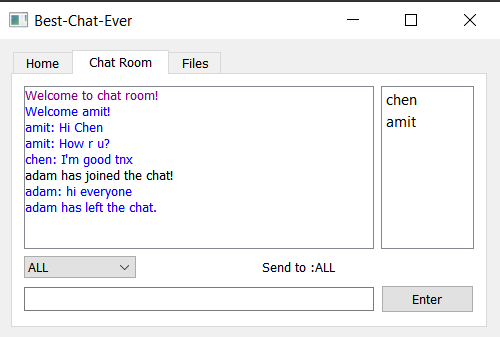

# Computer_Networking_Final_Project

    This project represents the final assignment in the Computer Networking Course (Ariel University, 2022)
    The project presents a Messenger App with the ability to downloading files from the server.
    The text messsaging is over TCP and the downloading files is over reliabel UDP using Go Back N.

## How To Run The Program:
    * Download the project to your own computer
    * Open the project
    * In order to run the srever write the following lines in the Terminal:
        cd server
        python server.py
    * In case you want to connect to a specific IP and port, write the following line in the Terminal:
        python server.py --host (IP) --port (ports number)
    * In order to run the client side write the following lines in a new Terminal:
        cd client
        python client.py
    A UI window will pop up
    Make sure the IP is correct
    * Enter your username in the username box
    * Click connect
    
    Now the program is running and all you have to do is start chatting.

    * In order to chat from different computer in the same local network only one user has to run the server,
    the rest, run only the client side and enter the server's IP.
    
Enjoy!
    
    
    
    
